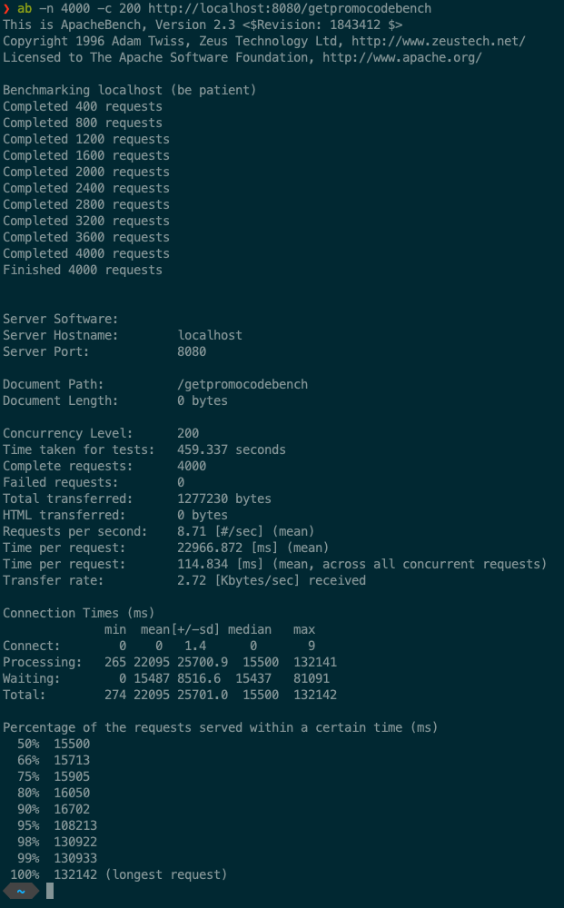

# Promocode service

## Installation

```
make install
```

Open: http://localhost:8080/signin

Adminer: http://localhost:8081/?server=mysql&username=root&db=promocode (Password in .env file)

## Generate Promocodes

```
make generate ARGS="1000"
```

## Testing

The project has been load tested **locally** with [Apache Benchmark](https://httpd.apache.org/docs/2.4/programs/ab.html). 

Promocodes was in the table: 500.000.

```
ab -n 4000 -c 200 http://localhost:8080/getpromocodebench
```

### Result


